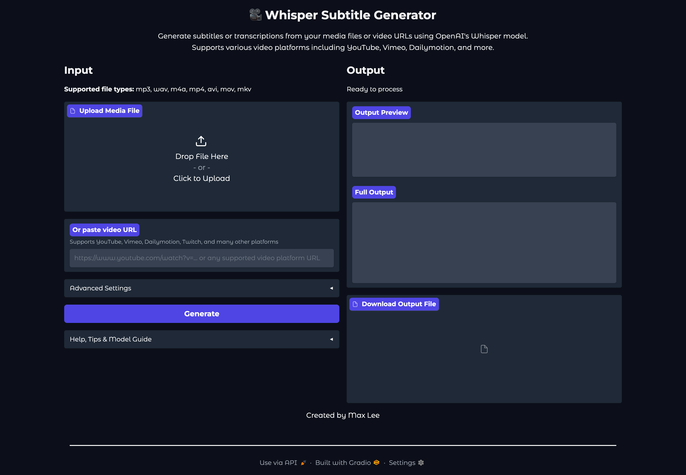

# Whisper Subtitle Generator

Generate subtitles or transcriptions from your media files or video URLs using OpenAI's Whisper model. Supports various video platforms including YouTube, Vimeo, Dailymotion, and more.


## Features
- Modern Gradio web interface with two-column layout
- Prominent Help, Tips & Model Guide section
- Custom footer and author credit
- Upload audio/video files or paste a video URL (YouTube, Vimeo, Dailymotion, Twitch, etc.)
- Supported file types: mp3, wav, m4a, mp4, avi, mov, mkv
- Choose Whisper model size and device (CPU, CUDA, Apple Silicon MPS)
- Model download/caching in project folder or system cache
- Remove downloaded models and clear transcription cache with one click
- Output preview, full output, and downloadable SRT or TXT file
- Output file is named after the video title or uploaded file
- Progress bar and status messages for all steps

## Installation
1. Clone this repository
2. (Recommended) Create and activate a Python virtual environment
3. Install dependencies:
   ```bash
   pip install -r requirements.txt
   ```

## Usage
1. Run the app:
   ```bash
   python app.py
   ```
2. Open the local URL shown in your terminal (usually http://127.0.0.1:7860)
3. Upload a media file **or** paste a supported video URL
4. Adjust settings as needed (model size, device, language, etc.)
5. Click **Generate**
6. Download your output file (SRT or TXT)



### Notes
- Output files are named after the video title (for URLs) or the uploaded file name.
- Models are cached in the project `models/` folder or in your system cache (`~/.cache/whisper`).
- Use the "Remove Downloaded Models" button in Advanced Settings to clear model files.
- Use the "Clear Transcription Cache" button to remove cached outputs.
- The app supports non-commercial use only. See LICENSE for details.
- Downloading video/audio from third-party platforms may be subject to copyright laws. **You are responsible for ensuring your use complies with all applicable laws and platform terms.**

## License
See [LICENSE](LICENSE) for non-commercial use terms and copyright/copyright-disclosure.

---
Created by Max Lee 